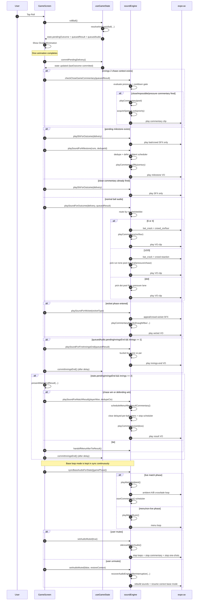

# Audio Playback Sequence

```mermaid
sequenceDiagram
    autonumber
    participant U as User
    participant GS as GameScreen
    participant UGS as useGameState
    participant SE as soundEngine
    participant AV as expo-av

    U->>GS: Tap Roll
    GS->>UGS: rollBall()
    UGS->>UGS: resolveAndApplyBall(...)
    UGS-->>GS: state.pendingOutcome + queuedResult + queuedAudio
    GS->>GS: Show DiceRollAnimation

    Note over GS: Dice animation completes
    GS->>UGS: commitPendingDelivery()
    UGS-->>GS: state updated (lastOutcome committed)

    alt innings 2 chase context exists
        GS->>SE: checkCloseGameCommentary(queuedResult)
        SE->>SE: evaluate pressure + cooldown gate
        alt close/impossible/pressure commentary fired
            SE->>SE: playCommentary(pool)
            SE->>SE: acquireSpeechLock(priority)
            SE->>AV: play commentary clip
        end
    end

    alt pending milestone exists
        GS->>SE: playSfxForOutcome(delivery)
        SE->>AV: play bat/crowd SFX only
        GS->>SE: playSoundForMilestone(runs, dedupeId)
        SE->>SE: dedupe + defer ambient scheduler
        SE->>SE: playCommentary(fifty|century)
        SE->>AV: play milestone VO
    else close commentary already fired
        GS->>SE: playSfxForOutcome(delivery)
        SE->>AV: play SFX only
    else normal ball audio
        GS->>SE: playSoundForOutcome(delivery, queuedResult)
        SE->>SE: route by runs/wicket/dot
        alt 6 or 4
            SE->>AV: bat_crack + crowd_six/four
            SE->>SE: playCommentary(six/four)
            SE->>AV: play VO clip
        else 1/2/3
            SE->>AV: bat_crack + crowd reaction
            SE->>SE: pick run tone pool (neutral/pressure/chase)
            SE->>AV: play VO clip
        else dot
            SE->>SE: pick dot pool from pressure lane
            SE->>AV: play VO clip
        end
    end

    alt wicket phase entered
        GS->>SE: playSoundForWicket(wicketType)
        SE->>AV: appeal/crowd wicket SFX
        SE->>SE: playCommentary(bowled/caught/lbw/...)
        SE->>AV: play wicket VO
    end

    alt queuedAudio.pendingInningsEnd && innings == 1
        GS->>SE: playSoundForFirstInningsEnd(queuedResult)
        SE->>SE: bucket by score vs par
        SE->>AV: play innings-end VO
        GS->>UGS: commitInningsEnd() (after delay)
    end

    alt state.pendingInningsEnd && innings == 2
        GS->>GS: presentMatchEndResult(...)
        alt chase win or defending win
            GS->>SE: playSoundForMatchResult(playerWon, dedupeCtx)
            SE->>SE: scheduleMenuAfterResultCommentary()
            SE->>SE: clear delayed per-ball timers + stop scheduler
            SE->>SE: playCommentary(win|loss)
            SE->>AV: play result VO
        else tie
            GS->>SE: handoffMenuAfterTieResult()
        end
        GS->>UGS: commitInningsEnd() (after delay)
    end

    Note over GS,SE: Base loop mode is kept in sync continuously
    GS->>SE: syncBaseAudioForState({gamePhase})
    alt live match phase
        SE->>SE: playMatchAmbient()
        SE->>AV: ambient A/B crossfade loop
        SE->>SE: startCommentary() scheduler
    else menu/non-live phase
        SE->>SE: playMenuMusic()
        SE->>AV: menu loop
    end

    alt user mutes
        GS->>SE: setAudioMuted(true)
        SE->>SE: silenceAllUserAudio()
        SE->>AV: stop loops + stop commentary + stop one-shots
    else user unmutes
        GS->>SE: setAudioMuted(false, restoreContext)
        SE->>SE: recoverAudioEngineAfterInterruption(...)
        SE->>AV: rebuild sounds + resume correct base mode
    end
```
